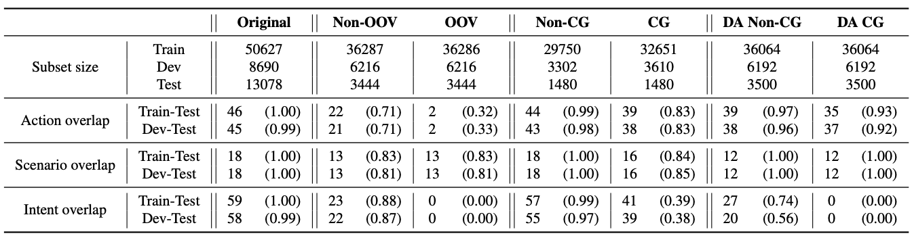

# SLURPFOOD

This repository contains the SLURPFOOD splits proposed in the paper "[Out-of-distribution generalisation in spoken language understanding](https://arxiv.org/abs/2407.07425)".
Additionally, it contains scripts for generating the splits and creating the baselines.

To start, you need to first clone the original [SLURP repository](https://github.com/pswietojanski/slurp) in the parent directory.

Then you need to download the SLURP audio files by navigating to `cd slurp/scripts` and running `./download_audio.sh`.


The `slurpfood` directory contains two subdirectories: `scripts` and `splits`. The `scripts` contains the scripts used for reproducing the splits and the `splits` contains the actual data splits in JSON and CSV formats.

In the `experiments` directory are the [SpeechBrain](https://github.com/speechbrain/speechbrain) recipes for training the models discussed in the paper. To run the experiments, you need to run `python train.py hyperparams.yaml`. The `train.py` contains the main code for training and inference, whereas the `hyperparams.yaml` contains the hyperparameters.


## SLURPFOOD splits
For all the splits we used the scenario classification task, but some splits can be adapted for intent classification. The splits are derived from the official train, dev, and test portions of the original SLURP dataset.\
The table below shows class overlaps (intersections of class sets) between the train, dev, and test subsets for each label type (scenario, action, intent). In the brackets are the similarities of the frequency distributions of labels in the different subsets.
<!--  -->


### OOV splits
These splits are used to assess the model's OOV generalisation ability when the scenario is seen in training, but the task (action) is novel.
For instance, the training set may contain "launch super mario" where the scenario is "play" and the action is "game". Conversely, the test set could include an instruction "please play the next episode in the podcast", maintaining the "play" scenario, but in a combination with a novel "podcast" action.

### CG splits
The CG splits are generated with the [distribution-based compositionality assessment (DBCA)](
https://doi.org/10.48550/arXiv.1912.09713) framework. To create a train-test split that requires compositional generalisation, the atom divergence should be similar between train and test splits, while compound distribution should diverge. In our CG splits, atoms are defined as the scenario and action labels, and the compound in each utterance is the combination of the two, i.e. the intent.

### DA-CG splits
These splits are used to predict the scenario from a combination of two utterances with different actions but the same scenario. For the CG split, we ensured that no combination of the same two actions present in the test set appears in the training or development splits.

### Microphone mismatch splits
The goal of these splits is to test the generalisation of the models in mismatched acoustic environments. To achieve that, we used the recordings that were done with a headset as part of the training and development portions. The test set consists of two subsets. The first one contains the recordings done with a headset, while the second one contains the same recordings, but without a headset.

##
To cite the paper, use:

```
@inproceedings{porjazovski24_interspeech,
  title     = {Out-of-distribution generalisation in spoken language understanding},
  author    = {Dejan Porjazovski and Anssi Moisio and Mikko Kurimo},
  year      = {2024},
  booktitle = {Interspeech 2024},
  pages     = {807--811},
  doi       = {10.21437/Interspeech.2024-940},
  issn      = {2958-1796},
}
```
